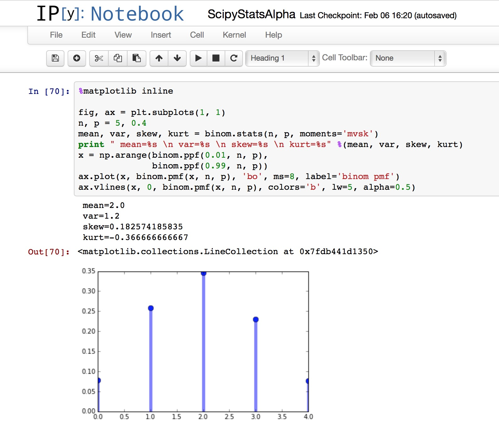

Ipython是一个python的交互式shell, 相对于python的Shell来说会更好用，ipython支持变量自动补全，自动缩进，内置了许多比较有用的功能和函数[1]。其中ipython notebook是一款基于浏览器的iPython交互式界面，界面较为美观，并且结合了markdown，从而方便了报告的制作，能够在进行python计算的同时编写文档，类似于Rstudio中结合了Rmarkdown的报告生成方式。

######Install Ipython
在之前的文章[Python Package的安装方法](http://xw393.github.io/blog/2015/02/03/python_packages.html)中，可以运用**pip**的方法安装ipython以及ipython notebook，代码如下：  

pip install ipython  
pip install "ipython[notebook]"


######Anaconda   
此外，由于Python有不同的版本存在，每个版本所包含的packages有所不同，期中**Anaconda**是一个内容比较丰富的版本。该版本的Python中包含了195个最流行的Python Packages,涵盖了科学、数学、工程以及数据分析方面的packages。  
下载地址请戳：[Anaconda](http://continuum.io/downloads)

######Python IDE   
在编写代码的时候，拥有一个好的IDE不但能够提高工作效率而且能够使得心情比较愉悦，Python的IDE有很多种，娴熟的程序员会选择使用**Emacs, Vim**等强大的代码编辑器，通过自己搭建工作环境进行代码的写作，但是**Emacs, Vim**
的学习曲线比较陡峭，不是非常容易上手，因此在不熟练的时候使用这些代码编辑器反而会使得写代码的体验大大下降。在使用了多个Python的IDE之后，现在个人比较推荐使用的是**Spyder**,提供代码自动补全，语法高亮，界面类似于Rstudio，简单容易，方便设置，出错较少。  
下载地址请戳：[Spyder](https://code.google.com/p/spyderlib/)

######Ipython交互式界面

